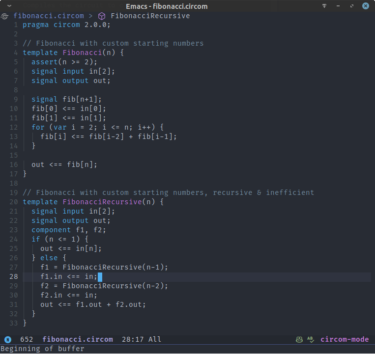

# circom-mode

Emacs major mode for editing [Circom](https://iden3.io/circom) circuits.

## Installation

This package is published in [Melpa](https://melpa.org/). The recommended installation is to install through Melpa using `M-x package-install` ([getting started with Melpa](https://melpa.org/#/getting-started)) or install directly from this repository using [straight.el](https://github.com/radian-software/straight.el) ([configure your custom recipe](https://github.com/radian-software/straight.el?tab=readme-ov-file#installing-with-a-custom-recipe)).

If you use Doom Emacs, put `(package! circom-mode)` in the package file `doom/packages.el`.

## Features

- Syntax highlighting.
- Code auto-indentation.
- Code outline via [imenu](https://www.gnu.org/software/emacs/manual/html_node/emacs/Imenu.html).

## Screenshots

## Contributing

Issue reporting and PRs are welcome! :)
